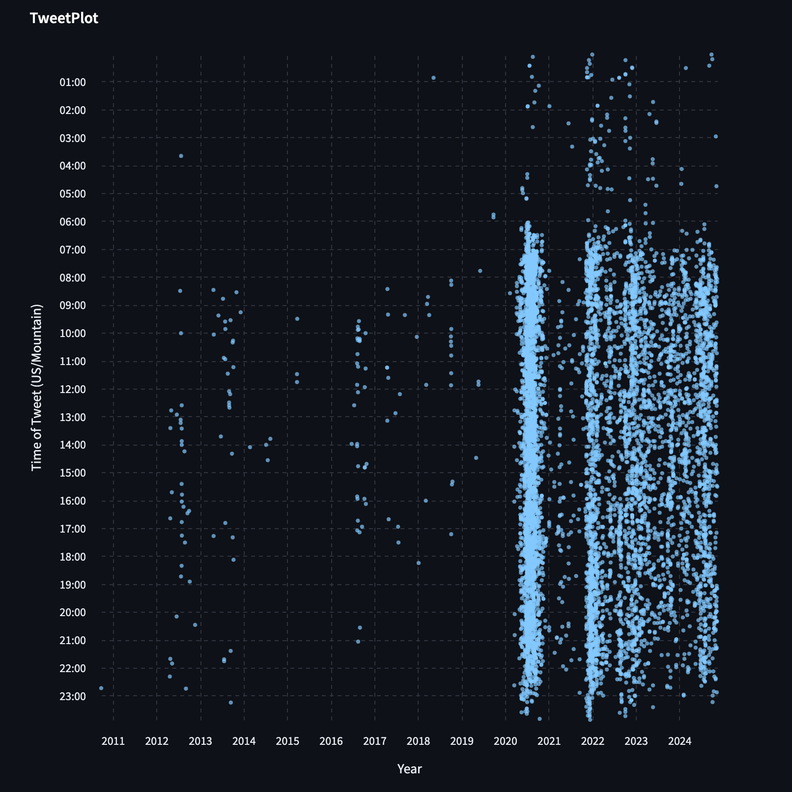

# Welcome to TweetPlot

[TweetPlot](https://tweetplot.streamlit.app)

Get a cool scatter plot of your twitter history.

1. Choose your timezone
2. Upload the `twitter-headers.js` file from your twitter backup
3. Skeet the picture?
4. Say hi: [Evan Anderson](https://bsky.app/profile/syndrowm.com)

Should look something like this:

Shout out to:
[Hank](https://bsky.app/profile/hankgreen.bsky.social/post/3lbldm2xeuc2c)
[Tomnomnom](https://bsky.app/profile/tomnomnom.com/post/3lblghzb6qc2u)

